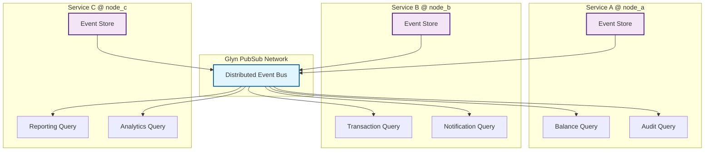

# eventsourcing_glyn

[](https://hex.pm/packages/eventsourcing_glyn)
[](https://hexdocs.pm/eventsourcing_glyn/)

A distributed event sourcing library for Gleam that enhances existing event stores with [Glyn](https://hex.pm/packages/glyn) PubSub and Registry capabilities for distributed query actors, event broadcasting, and fault-tolerant command routing.

## Features

- **🔄 Distributed PubSub**: Query actors automatically subscribe to events across multiple nodes
- **🛡️ Fault Tolerance**: Built-in OTP supervision for all distributed components  
- **🔌 Store Agnostic**: Works with any underlying event store (memory, PostgreSQL, etc.)
- **⚡ Type Safety**: Full Gleam type safety with generic event and entity types
- **📡 Event Broadcasting**: Automatic distribution of committed events to all subscribers
- **🎯 Zero Configuration**: Minimal setup required to add distributed capabilities

## Installation

Add `eventsourcing_glyn` to your Gleam project:

```sh
gleam add eventsourcing_glyn
```

## Quick Start

```gleam
import eventsourcing_glyn
import eventsourcing/memory_store
import gleam/otp/static_supervisor

// 1. Set up your underlying event store (memory, postgres, etc.)
let #(underlying_store, memory_spec) = memory_store.supervised(
  events_name,
  snapshots_name, 
  static_supervisor.OneForOne
)

// 2. Configure Glyn for distributed coordination
let config = eventsourcing_glyn.GlynConfig(
  pubsub_scope: "bank_events",
  pubsub_group: "bank_services" 
)

// 3. Define query actors that will receive events
let queries = [
  #("balance_query", balance_query_function),
  #("audit_query", audit_query_function),
]

// 4. Create the distributed event store
let assert Ok(#(glyn_eventstore, glyn_spec)) = 
  eventsourcing_glyn.supervised(
    config,
    underlying_store,
    queries,
    your_event_decoder()
  )

// 5. Start supervision tree
let assert Ok(_supervisor) =
  static_supervisor.new(static_supervisor.OneForOne)
  |> static_supervisor.add(memory_spec)  
  |> static_supervisor.add(glyn_spec)
  |> static_supervisor.start()

// 6. Use the event store normally - events are automatically distributed!
eventsourcing.execute(command_processor, aggregate_id, command)
```

## Architecture

The library wraps your existing event store with a `GlynStore` that adds distributed capabilities:



When events are committed to any service, they're automatically broadcast to all query actors across all connected nodes.

## Distributed Nodes Example

The `examples/distributed_nodes` directory demonstrates running multiple services:

```bash
# Terminal 1 - Inventory Service
cd examples/distributed_nodes/inventory_service
ERL_FLAGS="-sname inventory@localhost -setcookie eventsourcing" gleam run

# Terminal 2 - Order Service  
cd examples/distributed_nodes/order_service
ERL_FLAGS="-sname order@localhost -setcookie eventsourcing" gleam run
```

Or use the startup script:

```bash
./distributed_start.sh
```

See the [distributed nodes README](examples/distributed_nodes/README.md) for complete setup instructions.

## API Documentation

### Types

#### `GlynStore(underlying_store, entity, command, event, error, transaction_handle)`

An opaque type that wraps an existing event store with Glyn distributed capabilities.

#### `GlynConfig`

Configuration for the distributed event sourcing:

```gleam
pub type GlynConfig {
  GlynConfig(
    pubsub_scope: String,  // Unique scope for PubSub topics
    pubsub_group: String   // Group name for subscriber discovery
  )
}
```

### Functions

#### `supervised`

Creates a supervised Glyn-enhanced event store:

```gleam
pub fn supervised(
  config: GlynConfig,
  underlying_store: eventsourcing.EventStore(...),
  queries: List(#(process.Name(QueryMessage(event)), Query(event))),
  event_decoder: decode.Decoder(event),
) -> Result(
  #(
    eventsourcing.EventStore(...),
    supervision.ChildSpecification(static_supervisor.Supervisor)
  ),
  String
)
```

**Important Note about Event Decoders:**
The `event_decoder` parameter must be designed to decode Erlang dynamic data structures, not JSON. When events are distributed via Glyn PubSub, they are serialized using Erlang's native term format. Your decoder should use `gleam/dynamic/decode` functions to handle Erlang tuples and atoms.

Example event decoder for Erlang data:

```gleam
import gleam/dynamic/decode
import gleam/erlang/atom

pub fn event_decoder() -> decode.Decoder(MyEvent) {
  use tag <- decode.field(0, atom.decoder())
  case atom.to_string(tag) {
    "user_created" -> {
      use id <- decode.field(1, decode.string)
      use name <- decode.field(2, decode.string)
      decode.success(UserCreated(id, name))
    }
    "user_updated" -> {
      use id <- decode.field(1, decode.string)
      use new_name <- decode.field(2, decode.string)
      decode.success(UserUpdated(id, new_name))
    }
    _ -> decode.failure(UserCreated("", ""), "Unknown event type")
  }
}
```

#### `publish`

Manually publish an event to distributed query subscribers:

```gleam
pub fn publish(
  glyn_store: GlynStore(...),
  group: String,
  message: QueryMessage(event),
) -> Result(Int, eventsourcing.EventSourcingError(error))
```

## Requirements

- Gleam >= 1.0.0
- Erlang/OTP >= 25.0
- Services must be running as distributed Erlang nodes (same cookie)

## Contributing

Contributions are welcome! Please feel free to submit a Pull Request.

## License

This project is licensed under the MIT License - see the [LICENSE](LICENSE) file for details.
